  

  

  
  
  
  

  

## About me

I am **Roman Ullah**, a final-year Computer Science student in Pakistan building toward a career in AI and machine learning engineering. I learn best by turning concepts into small, practical projects, then documenting what worked, what did not, and what I understood.

My current work combines Python, data analysis, foundational machine learning, and software development. I care about understanding *why* a system behaves the way it does—not only getting code to run—and I document that progress in my [90 Days AI/ML Roadmap](https://github.com/coderomantor/90-Days-AI-ML-Roadmap), which retains its original repository name while now following a mentor-reviewed 100-day AI Engineer plan.

## Current focus

| Signal | Right now |
| :-- | :-- |
| **Building** | End-to-end machine learning projects |
| **Learning** | Regression, classification, model evaluation, and AI engineering |
| **Roadmap** | Mentor-reviewed 100-day AI Engineer plan |
| **Career goal** | Junior AI/ML Engineer or ML Internship |
| **Location** | Pakistan |
| **Status** | Open to relevant opportunities |

## Featured projects

### 01 — [90 Days AI/ML Roadmap](https://github.com/coderomantor/90-Days-AI-ML-Roadmap)

> **PUBLIC · ACTIVE LEARNING JOURNEY**
>
> A public learning repository that began as a 90-day challenge and now follows a mentor-reviewed 100-day AI Engineer plan. It documents completed foundations and the planned path toward deployment, LLM applications, and agentic AI.
>
> **Technologies:** `Python` · `NumPy` · `Pandas` · `SQL` · `Scikit-learn`

### 02 — [Grammar Workbench](https://github.com/coderomantor/Grammar_Workbench_Build_Spec)

> **PUBLIC · WORKING REPOSITORY**
>
> A React and TypeScript grammar-analysis application covering FIRST and FOLLOW sets, LL(1) parsing tables, grammar transformations, and predictive parsing.
>
> **Technologies:** `React` · `TypeScript` · `CSS`

### 03 — [AsifLang Interpreter](https://github.com/coderomantor/asiflang-interpreter)

> **PUBLIC · SEMESTER PROJECT**
>
> A small interpreter demonstrating lexical analysis, parsing, abstract syntax trees, variables, arithmetic expressions, and execution.
>
> **Technology:** `Python`

### 04 — [Forganizer](https://github.com/coderomantor/Forganizer)

> **PUBLIC · WINDOWS UTILITY**
>
> A Windows file-organization utility designed to sort files automatically according to file type.
>
> **Technologies:** `Python` · `Windows`

<!-- Hosh and ALVINA deliberately have no repository links until public code is available and ownership permits linking. -->

### 05 — Hosh

> **IN DEVELOPMENT · NO PUBLIC REPOSITORY**
>
> A minimalist Android launcher designed to reduce phone distraction and encourage more intentional smartphone use.
>
> **Technologies:** `Jetpack Compose` · `Android`

### 06 — ALVINA

> **PRIVATE / UNDER DEVELOPMENT · CONTRIBUTOR**
>
> A multi-agent AI assistant platform to which I have contributed. The wider platform uses a Next.js frontend, NestJS backend, Python orchestration, PostgreSQL, Redis, embeddings, persistent chat, workflows, and tool-based AI interaction.
>
> **Platform stack:** `Next.js` · `NestJS` · `Python` · `PostgreSQL` · `Redis` · `Embeddings`

## Technologies I use

### Languages

  
  
  
  
  
  
  

### AI, machine learning, and data

  
  
  
  
  

`Data cleaning` · `Exploratory data analysis` · `Feature and target selection` · `Train/validation/test splitting` · `Linear regression` · `Logistic regression` · `Classification probabilities` · `Baseline models` · `Model persistence` · `Basic statistics` · `SQL-based business analysis`

### Development and software tools

  
  
  
  
  
  
  
  
  
  

## Currently learning

These are active learning areas—not claims of expert-level experience.

`End-to-end ML workflows` · `Feature engineering` · `Model evaluation` · `AI engineering` · `LLM applications` · `Embeddings` · `Retrieval-Augmented Generation` · `Model deployment` · `MLOps foundations` · `Production-ready AI systems`

## Public GitHub snapshot

The live cards below summarize public GitHub activity. The language card reflects code across public repositories and is **not** a measure of skill proficiency.

<!-- These cards depend on public third-party services and can occasionally be rate-limited. The written project record above remains the source of context if an image is unavailable. -->

  
  

  

  

  
<strong>GitHub trophies from public activity</strong>

   
  

    
  

  
These are automatically generated from public GitHub activity and are shown as a compact activity summary.

## Contribution journey

<!-- Generated daily by .github/workflows/snake.yml and served from the output branch. -->

<picture>
  <source media="(prefers-color-scheme: dark)" srcset="https://raw.githubusercontent.com/coderomantor/coderomantor/output/github-contribution-grid-snake-dark.svg" />
  <source media="(prefers-color-scheme: light)" srcset="https://raw.githubusercontent.com/coderomantor/coderomantor/output/github-contribution-grid-snake.svg" />
  
</picture>

  <strong>Interested in working together?</strong> 
  If my work aligns with your team, the best way to reach me is on LinkedIn.

  

  

